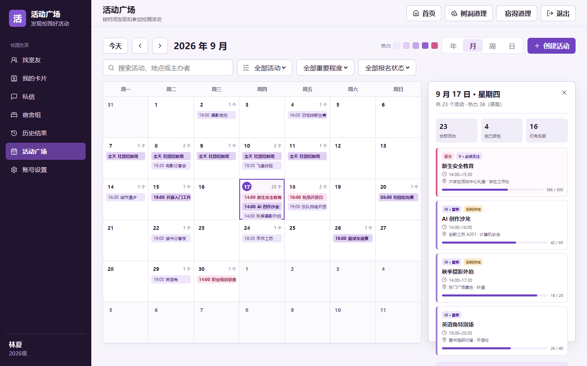
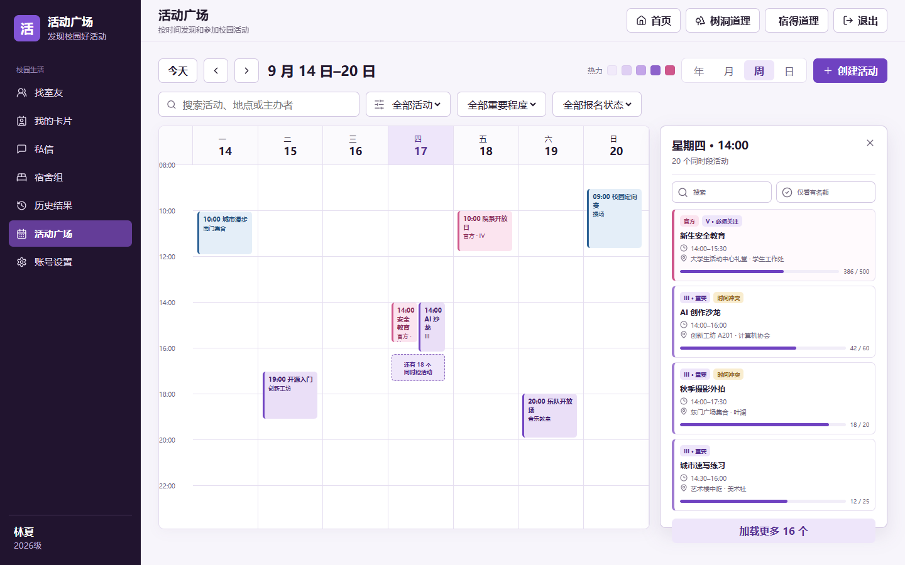
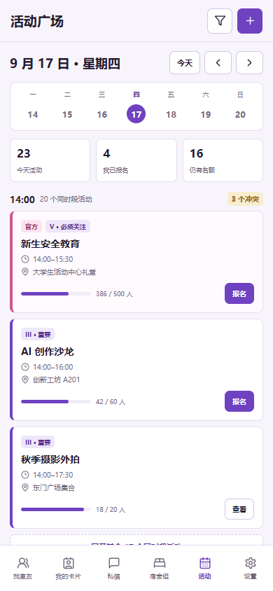
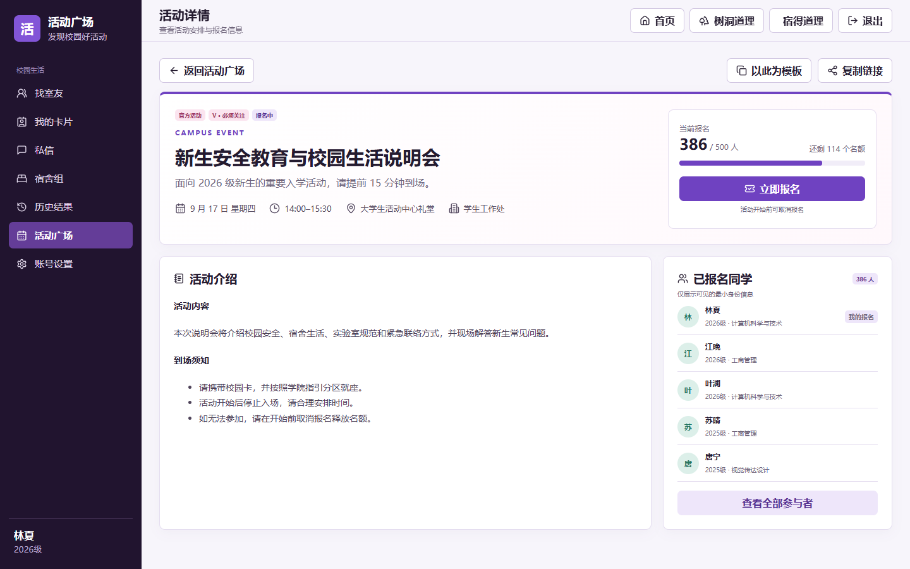
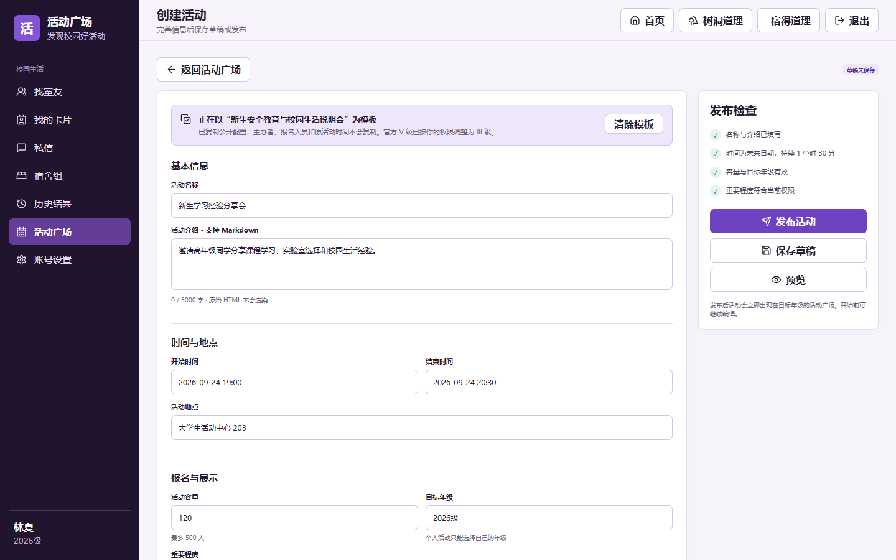

# “活动广场”页面设计

## 交互 Demo

可直接打开 [活动广场交互 Demo](mockups/activity-plaza-demo.html) 调整和验证页面细节。为了避免浏览器限制本地资源，也可以在仓库根目录启动静态服务器：

```powershell
python -m http.server 8000
```

然后访问 `http://localhost:8000/docs/mockups/activity-plaza-demo.html`。

Demo 使用固定演示时间 `2026-09-17 09:00`，包含年/月/周/日视图、筛选、日期与拥挤时段抽屉、活动详情、报名/取消报名、从模板创建、预览、保存草稿和发布。报名及新建数据保存到当前浏览器的 `localStorage`，页面顶部“重置演示”可恢复初始状态。

样式和交互逻辑分别位于：

- [`activity-plaza-demo.css`](mockups/activity-plaza-demo.css)
- [`activity-plaza-demo.js`](mockups/activity-plaza-demo.js)

运行 `node docs/mockups/check-activity-plaza-demo.js` 可以执行桌面端和移动端关键交互检查。

## 1. 背景与目标

“活动广场”用于集中展示校内活动安排，让学生按年、月、周、日查看活动，快速判断时间冲突，并完成活动创建、报名和取消报名。

一期目标：

- 用统一日历承载个人活动和校方重要活动；
- 在同一时段存在约 20 个活动时仍能快速浏览，不让日历列无限变窄；
- 明确展示活动时间、地点、主办者、容量、报名人数和重要程度；
- 支持从已有活动复制公开配置，减少重复创建成本；
- 保证容量扣减、编辑冲突、权限和审计在服务端可靠执行。

一期不实现重复活动规则、候补队列、付费、票券、签到、评论、附件上传、外部报名链接、个性化推荐和系统级消息推送。跨日活动和全天活动可以创建，但每条活动仍是独立记录，不展开为重复日程。

## 2. 术语与参与者

### 2.1 术语

- **活动**：有明确起止时间、主办者和地点的可报名日程。
- **个人活动**：普通学生以本人名义创建的活动，重要程度只能为 1–3 级。
- **官方活动**：由具备活动发布权限的管理员以某个有效管理员组名义发布的活动，可以设置 1–5 级重要程度。
- **重要程度**：活动在日历中的视觉优先级和热力权重，不代表报名热度。使用 1–5 级离散值，权重与等级相同。
- **时段簇**：同一天内起始时间相同或视觉上发生重叠的一组活动。时段簇是前端解决大量并发活动的展示单元，不是新的业务实体。
- **可见活动**：当前用户按状态、目标年级和治理规则有权读取的活动。热力值和数量只基于可见活动计算。

### 2.2 参与者

- **普通学生**：状态正常的已登录普通账号。可以浏览可见活动、创建个人活动、报名和取消报名。
- **活动发起者**：创建个人活动的学生，或代表管理员组创建官方活动的管理员。可以编辑、取消和复制自己有权管理的活动。
- **活动管理员**：通过同一个有效管理员组获得活动权限并覆盖活动目标年级的管理员。
- **超级管理员**：直接通过活动权限层，但仍必须遵守状态、容量、确认、并发和审计约束。

管理员在学生端以个人身份创建活动时遵循普通学生规则。只有明确切换为某个有权代表的管理员组后，活动才显示为官方活动。

## 3. 页面、路由与导航

### 3.1 入口与默认行为

- 顶栏增加“活动广场”入口，建议主路由为 `/activities`。
- 未登录用户可以看到入口，但访问后重定向到 `/login?next=/activities`。
- 登录后默认打开月视图，并定位到用户设备当前日期；服务端时间判断统一使用 `Asia/Shanghai`。
- 用户上次选择的视图、筛选条件只保存在当前设备；URL 中的日期和视图优先，后端仍重新校验所有读取权限。

### 3.2 路由建议

| 路由 | 页面 |
|---|---|
| `/activities?view=month&date=2026-09-17` | 年/月/周/日视图，`view` 可为 `year`、`month`、`week`、`day` |
| `/activities/{id}` | 活动详情 |
| `/activities/new` | 创建活动 |
| `/activities/new?template={id}` | 从有权读取的活动创建副本 |
| `/activities/{id}/edit` | 编辑有权管理的活动 |

日期使用 `YYYY-MM-DD`。非法日期、非法视图或不存在的活动不得导致前端崩溃；非法查询参数回退到当月，详情资源统一显示“活动不存在或暂不可访问”。

### 3.3 页面骨架

桌面端从上到下包含：

1. 页面标题、当前日期范围和“创建活动”按钮；
2. “今天”、上一时间段、下一时间段、日期标题和年/月/周/日切换器；
3. 搜索与筛选栏；
4. 日历主体；
5. 按需打开的活动预览浮层或右侧抽屉。

移动端保留顶部日期导航和视图切换，筛选折叠为单独按钮。底部导航保持现有应用结构；日历不能依赖桌面侧栏才能操作。

## 4. 公共筛选与查询规则

支持以下条件：

- 关键词：匹配活动名称、介绍纯文本摘要、地点和主办者显示名；
- 活动类型：全部、官方活动、个人活动；
- 重要程度：1–5 级，可多选；
- 报名状态：全部、我已报名、我创建的、仍有名额；
- 目标年级：默认只显示当前用户可见范围；管理员预览时可以选择自己有权管理的年级；
- 地点关键词。

筛选在四种视图间保持。改变筛选后从服务端重新获取当前可见时间范围的聚合与活动摘要，不能只隐藏已经加载的部分数据，否则热力值、数量和分页会失真。

关键词去除首尾空白，最长 80 个字符。搜索使用 300 毫秒防抖，但按回车立即提交。前端取消过期请求，后端对同一会话的读取请求设置合理频率限制。

## 5. 活动字段与状态

### 5.1 活动字段

| 字段 | 规则 | 列表展示 |
|---|---|---|
| 活动名称 | 必填，1–80 个字符，纯文本 | 是 |
| 活动介绍 | Markdown，0–5000 个字符 | 只展示服务端纯文本摘要 |
| 开始、结束时间 | 必填，结束时间必须晚于开始时间，最长持续 14 天 | 是 |
| 全天活动 | 布尔值；全天时按自然日展示，不伪造 `00:00–23:59` 文案 | 是 |
| 活动地点 | 必填，1–120 个字符，纯文本 | 是 |
| 主办者 | 个人账号或有效管理员组，由后端确定，不能提交任意内部 ID 冒充 | 是 |
| 活动容量 | 必填，1–500 人；已有人报名后不能改成小于当前人数 | 是 |
| 当前参加人员 | 由有效报名关系实时计算，不能接受客户端提交的计数 | 数量；详情展示最小身份列表 |
| 重要程度 | 1–5 级；个人活动最高 3 级，4–5 级需要 `ACTIVITY_IMPORTANCE_SET` | 是 |
| 目标年级与群组 | 年级和群组至少选择一项；个人活动可选择自己的年级和有权使用的学生群组，官方活动按管理范围选择 | 筛选中展示 |

活动介绍复用现有安全 Markdown 管线：数据库保存原文，服务端关闭原始 HTML、清洗渲染结果，并额外生成纯文本摘要。列表接口不返回完整 Markdown 和完整 HTML。

### 5.3 目标学生群组

- 每位正常状态的用户都可以创建、编辑和删除自己的学生群组，并从正常或未激活状态的学生账号中选择成员；创建者始终自动加入且不能从自己的群组中移除；
- 成员选择支持按姓名、登录标识、年级或专业搜索，并可一键选中当前搜索结果。搜索和批量选择只作用于当前显示范围，不取消此前选择；
- 用户群组和超级管理员创建的预设学生群组共用 `student_selection_groups` 与 `student_selection_group_members`，不是活动模块私有数据；
- 群组名称在同一创建者名下唯一。用户只能修改和删除自己创建的群组，超级管理员继续通过既有管理接口维护管理员群组；
- 活动创建表单只展示本人创建的群组和管理员显式公开的共享群组。个人群组仅创建者可选择；超级管理员可以设置自己的管理员群组是否公开。可见群组可以与目标年级组合选择，最终目标人群取并集；
- 发布活动时，服务端把年级和群组解析成去重后的成员快照。发布后的活动可见范围不随群组改名、成员调整或删除而变化；
- 草稿编辑时重新读取当前群组数据。无权使用、已删除或包含异常账号的群组不得用于发布；
- 群组成员候选接口返回用于检索的姓名、登录标识、年级、专业和账号状态；保存后的普通用户群组详情不返回登录标识、联系方式、服装尺码等非必要字段。

### 5.2 状态

- `DRAFT`：草稿，仅发起者和有范围权限的活动管理员可见，不计入热力。
- `PUBLISHED`：已发布，可见并可报名，计入热力。
- `CANCELLED`：已取消，保留详情和参与记录，不计入热力，不能报名。
- `ENDED` 不单独持久化。`end_at <= now` 时由服务端计算为“已结束”，防止状态与时间漂移。

发布后不能回到草稿。取消活动属于显式状态变更，不直接删除。只有超级管理员可以永久删除测试或误建数据，且必须填写原因并二次确认。

## 6. 重要程度与热力规则

### 6.1 等级语义

| 等级 | 建议名称 | 使用场景 | 视觉表达 |
|---|---|---|---|
| 1 | 一般 | 兴趣交流、小型活动 | 最浅紫色，数字标识 `I` |
| 2 | 关注 | 常规社团或院系活动 | 浅紫色，数字标识 `II` |
| 3 | 重要 | 跨班级或名额有限活动 | 中紫色，数字标识 `III` |
| 4 | 很重要 | 校级安排、重要讲座 | 深紫色，数字标识 `IV` |
| 5 | 必须关注 | 影响广泛的关键安排 | 暖红强调，数字标识 `V` |

身份和重要程度不能只依靠颜色表达。活动块同时显示“官方”或 `I–V` 标识；色彩需满足正常文本和背景的可读性要求。

### 6.2 聚合分数

某自然日的热力分数为当日所有可见、已发布、未取消活动的重要程度权重之和：

```text
day_score = sum(activity.importance for activity overlapping the local calendar day)
```

跨日活动在经过的每个自然日各计一次对应权重。热力使用固定阈值，保证用户切换月份时颜色含义不变化：

- `0`：无活动；
- `1–3`：低；
- `4–8`：中低；
- `9–15`：中；
- `16–24`：高；
- `25+`：很高。

页面同时显示活动数量和热力图例，不能让用户把深色误解为“人数更多”。被取消、草稿、不可见活动和当前筛选排除的活动不参与分数。

## 7. 年视图

### 7.1 布局

- 桌面端以 `4 × 3` 网格展示 12 个月缩略日历；窄屏改为单列月份列表。
- 每个月仍显示星期标题和自然日格。日期格按该日热力分数填充离散颜色。
- 月卡片标题旁显示“活动数量”和该月最高热力等级，不显示完整活动名称。
- 点击月份标题进入该月；点击具体日期进入日视图。

### 7.2 大量活动

年视图只承担趋势判断，不在日期格中排列活动。日期格可在悬停或键盘聚焦时显示“9 月 17 日 · 23 个活动 · 热力 25”，避免缩略图信息过载。

## 8. 月视图

### 8.1 布局

- 使用 7 列月历，桌面端固定六行高度，保证切换月份时页面不跳动。
- 每个日期格显示日期、活动总数、最多 3 条活动摘要。
- 摘要包含开始时间、名称、重要程度标识；官方活动增加“官方”标识。
- 超过 3 条时显示“另有 N 个活动”，点击后打开该日抽屉，不继续撑高日期格。
- 跨日活动在各天显示，但只有首日显示完整名称；中间日期使用延续条和“继续”语义。
- 今天使用独立描边；选中日期使用实色日期圆点；非本月日期降低对比度但仍可点击。



_图 1：月视图以三条摘要和数量入口控制密度，右侧抽屉展示选中日期的完整列表。_

### 8.2 日期抽屉

抽屉按“全天活动、开始时间”排序；相同开始时间按重要程度倒序、活动 ID 倒序。每条活动显示：

- 时间和持续时长；
- 活动名称、官方/重要程度标识；
- 地点、主办者；
- `当前人数 / 容量` 和报名状态；
- 时间冲突标识。

抽屉一次加载 20 条，超过后继续分页。关闭抽屉后焦点返回触发日期，URL 保留当前视图与日期。

## 9. 周视图与并发活动展示

### 9.1 基础布局

- 七列分别表示一周七天，左侧为时间轴；默认展示 `06:00–24:00`。
- 更早的活动归入顶部“清晨”，跨越午夜的活动按实际日期分段展示。
- 活动块的垂直位置和高度反映开始时间与持续时长，但设置最小点击高度；过短活动仍显示准确时间。
- 全天活动固定在星期标题下方的独立区域，不与小时网格重叠。

### 9.2 同时段最多约 20 个活动

不能把 20 个活动横向压缩为 20 列。采用以下规则：

1. 先按时间重叠关系形成时段簇；
2. 一个时段簇最多使用两条可读泳道；
3. 第一条展示最高重要程度活动，第二条展示下一条；
4. 其余活动折叠为“还有 N 个同时段活动”的簇入口；
5. 点击任一活动或簇入口后，在右侧打开完整时段列表；
6. 侧边列表按重要程度倒序、开始时间、ID 倒序排列，并提供搜索和“仅看有名额”；
7. 键盘用户聚焦簇入口时能听到“14:00，共 20 个活动”，而不是只听到“更多”。

这种设计保证活动块至少保持可读宽度。颜色深度只表达重要程度，不能按泳道序号随机着色。



_图 2：周视图将大量重叠活动收敛为两条代表活动和一个聚合入口，完整结果在右侧抽屉中查看。_

## 10. 日视图与移动端

### 10.1 桌面端

- 左侧时间轴，右侧为当天纵向活动流。
- 不同开始时间按时间顺序排列；同一时段使用卡片组，而不是重叠定位。
- 时段组默认展示 3 条，剩余部分以“展开其余 N 个”控制。
- 顶部单独展示全天活动和当天统计：活动数、已报名数、仍有名额数。

### 10.2 移动端

- 日视图是移动端默认视图；月视图仍可选择，但月格只显示热力和活动数量，不塞活动名称。
- 日期使用横向七日选择条，左右滑动按周切换；切换后仍通过服务端加载对应日期。
- 活动卡片显示时间、名称、地点、主办者、容量和报名按钮。
- 同时段活动按卡片纵向排列，默认展示 3 条；展开后原位显示其余活动，避免狭窄抽屉。
- 底部导航不得遮挡最后一条活动，内容区域保留安全间距。



_图 3：移动端用日期条和纵向时段组替代压缩后的周网格，保留单手操作所需的点击面积。_

## 11. 活动详情与报名

### 11.1 详情结构

活动详情包含：

- 状态、官方标识和重要程度；
- 名称、完整时间、地点和主办者；
- 容量进度和当前报名人数；
- 经清洗的活动介绍；
- 参与者最小身份列表；
- 报名、取消报名、复制链接，以及发起者可见的编辑和取消入口。复制链接优先使用异步剪贴板接口，在浏览器拒绝该接口时使用兼容回退；复制成功后显示明确提示。

参与者列表只返回姓名、头像、年级和公开卡片 ID。衣服尺码、登录标识、账号状态、联系方式、内部管理字段和未发布卡片内容不得返回。存在拉黑关系或卡片被隐藏时，沿用现有隐私规则显示匿名占位。



_图 4：详情页把时间地点、容量和主操作放在首屏，介绍与参与者列表分区展示。_

### 11.2 报名规则

- 仅状态正常的普通学生可以报名；活动发起者不会自动占用名额，除非主动报名。
- 草稿、已取消、已结束或已经开始的活动不能新报名。
- 同一用户对同一活动最多一条有效报名关系。
- 报名时在写事务中重新读取活动状态和有效报名数；容量已满返回 `409 ACTIVITY_FULL`。
- 并发抢最后一个名额时最多一个请求成功，不能依赖页面上的旧计数。
- 用户可以在活动开始前取消报名；开始后保留参与记录，一期不提供补签或管理员代签。
- 报名成功后返回服务端最新人数和当前用户状态，前端不使用本地 `+1` 猜测结果。

一期不做候补队列。满员后按钮显示“名额已满”，容量释放后用户刷新或重新进入即可报名。

## 12. 创建、编辑与复制活动

### 12.1 创建表单

表单按以下分组：

1. 基本信息：名称、介绍、活动类型；
2. 时间地点：全天开关、开始时间、结束时间、地点；
3. 报名设置：容量、目标年级；
4. 展示优先级：重要程度和其权限说明；
5. 提交区：保存草稿、预览、发布。

开始和结束时间按本地时区输入，提交时使用带时区的 ISO 8601。前端可以提示时间冲突，但不能禁止创建冲突活动。

报名设置中同时提供目标群组多选和“管理我的群组”入口。创建或修改群组后，表单应刷新可选群组并保留仍然有效的选择；管理员已公开的共享群组以只读来源标识展示，个人群组不会出现在其他用户或管理员的目标群组列表。

### 12.2 从活动创建副本

- 详情页提供“以此为模板”入口；只要用户有权读取原活动即可使用。
- 复制名称、介绍、时长、地点、容量，以及用户有权使用的目标年级和重要程度。普通用户复制官方活动时，目标年级收敛为本人年级。
- 不复制活动 ID、状态、开始/结束绝对时间、主办者身份、报名人员、报名人数、审计记录和治理状态。
- 新活动开始时间默认为下一个整点，结束时间按原活动时长顺延；用户必须确认时间后才能发布。
- 普通用户复制 4–5 级官方活动时，重要程度自动降为 3 级，并在字段下明确提示原因；这属于当前权限约束，不是兼容旧行为。
- 副本始终以草稿形式打开，不允许通过复制接口直接发布。



_图 5：复制来源在表单顶部明确展示，受权限约束而调整的字段给出就地说明。_

### 12.3 编辑与并发

- 发起者可以在活动开始前编辑；开始后只允许补充介绍，不能改时间、容量、目标年级、主办者或重要程度。
- 已取消活动不能编辑或恢复。一期如需恢复，应复制为新活动。
- 更新请求携带 `version`。版本不一致返回 `409 ACTIVITY_EDIT_CONFLICT`，前端保留用户输入并要求重新加载，不能静默覆盖。
- 时间、容量、目标年级或状态变化后，服务端重新校验全部业务规则。
- 取消已有人报名的活动必须填写原因并二次确认；报名关系保留用于审计，详情显示取消原因。

## 13. 权限与管理范围

建议在固定权限白名单新增：

| 权限编码 | 能力 | 数据范围 |
|---|---|---|
| `ACTIVITY_READ` | 在管理端读取活动和报名摘要 | 活动目标年级 |
| `ACTIVITY_PUBLISH` | 代表管理员组创建和编辑官方活动 | 活动全部目标年级 |
| `ACTIVITY_IMPORTANCE_SET` | 设置 4–5 级重要程度 | 活动全部目标年级 |
| `ACTIVITY_MODERATE` | 取消、隐藏或永久删除违规活动 | 活动全部目标年级 |

规则如下：

- 普通学生创建个人活动不依赖管理权限，但目标年级固定为本人年级，重要程度最高 3 级；
- 管理员必须通过同一个有效管理员组同时获得所需权限并覆盖活动所有目标年级，不能拼接不同组的权限和范围；
- 超级管理员直接通过权限层，但不能绕过字段校验、容量、版本、确认和审计；
- 前端隐藏无权按钮只用于改善体验，所有限制必须由后端执行；
- 权限或管理员组关系撤销后，下一次请求立即失效。

## 14. 内容治理、隐私与安全

- 活动名称、地点、主办者显示名和列表摘要始终按纯文本转义。
- 活动介绍只插入服务端清洗后的 HTML；链接添加 `noopener noreferrer nofollow`。
- 详情及日历页面仅对登录用户开放，响应使用 `Cache-Control: private, no-store` 并增加 `noindex` 语义。
- 写操作校验 CSRF，并复用现有会话轮换与写请求频率限制。
- 查询时间范围设置上限：年视图最多 366 天，月视图最多 42 天，周视图 7 天，日视图 1 天。客户端不能通过任意起止时间一次拉取全部活动。
- 列表和聚合必须先应用可见性范围再计算数量与热力，不能通过聚合值推断无权查看的活动。
- 报名、取消报名、发布、编辑、取消、治理和永久删除均写审计日志。日志记录操作者、授权来源、目标、原因、请求 ID、IP、User-Agent、结果和变更摘要，不复制完整活动介绍或完整参与者名单。
- 账号停用或封禁后不能创建、编辑或报名；历史活动和报名关系保留。永久删除账号时，活动保留最小发起者快照，报名关系改为匿名占位。

## 15. 数据模型建议

### 15.1 `activities`

- `id`
- `title`
- `description_markdown`
- `description_html`
- `description_summary`
- `start_at`、`end_at`、`is_all_day`
- `location`
- `organizer_type`：`USER` 或 `ADMIN_GROUP`
- `organizer_user_id`、`organizer_group_id`：按类型二选一
- `organizer_name_snapshot`
- `capacity`
- `importance`：1–5
- `status`：`DRAFT`、`PUBLISHED`、`CANCELLED`
- `version`
- `cancel_reason`
- `created_by`、`created_at`、`updated_at`、`published_at`、`cancelled_at`

约束：`end_at > start_at`、`capacity BETWEEN 1 AND 500`、`importance BETWEEN 1 AND 5`，主办者类型与外键组合必须一致。建议索引 `(status, start_at, end_at)`、`(organizer_user_id, status)` 和 `(organizer_group_id, status)`。

### 15.2 `activity_target_grades`

- `activity_id`
- `grade_id`

对 `(activity_id, grade_id)` 建唯一约束。活动至少包含一个目标年级，该约束由事务校验。

### 15.3 `activity_registrations`

- `id`
- `activity_id`
- `user_id`：账号永久删除时可置空
- `participant_name_snapshot`
- `status`：`REGISTERED` 或 `CANCELLED`
- `registered_at`、`cancelled_at`

同一活动、同一非空用户最多一条记录；再次报名通过状态转换复用原记录，不插入重复行。容量判断与状态更新在同一写事务中完成。

### 15.4 群组目标与发布快照

- `activity_target_groups` 保存草稿选择，包含 `source_group_id` 和 `group_name_snapshot`；群组删除后 `source_group_id` 置空，快照名称保留；
- `activity_target_members` 保存发布时展开的去重成员，包含可空的 `user_id`、姓名和年级快照；
- 发布后的可见性和报名资格只读取 `activity_target_members`，不回查当前群组成员关系；
- `student_selection_groups.created_by` 作为群组所有者，并以 `(created_by, name)` 保证同一创建者名下名称唯一。

## 16. API 边界建议

### 16.1 日历与详情

- `GET /api/activities/calendar?view=month&date=2026-09-17&...`：返回当前时间范围的聚合、每日摘要和稳定排序信息。
- `GET /api/activities/day?date=2026-09-17&cursor=...`：返回某日活动完整摘要列表。
- `GET /api/activities/{id}`：返回活动详情、当前用户能力和报名状态。
- `GET /api/activities/{id}/participants?cursor=...`：分页返回可见参与者最小 DTO。

年、月接口不能返回所有活动详情；周视图只返回绘制活动块需要的摘要。详情和参与者按需加载。

### 16.2 写接口

- `POST /api/activities`：创建草稿。
- `PATCH /api/activities/{id}`：按 `version` 编辑。
- `POST /api/activities/{id}/publish`：发布草稿。
- `POST /api/activities/{id}/cancel`：填写原因后取消。
- `POST /api/activities/{id}/register`：报名。
- `DELETE /api/activities/{id}/registration`：取消报名。
- `POST /api/activities/{id}/copy`：返回经过权限裁剪的新草稿初始值，不直接写入新活动。
- `POST /api/activities/markdown/preview`：使用与详情一致的服务端 Markdown 管线。

学生群组复用独立接口：

- `GET /api/student-selection-groups`：返回当前用户可用于活动的本人群组与管理员已公开共享群组；
- `GET /api/student-selection-groups/candidates`：返回创建群组所需的最小候选人信息；
- `POST /api/student-selection-groups`、`PATCH /api/student-selection-groups/{id}`、`DELETE /api/student-selection-groups/{id}`：仅维护当前用户自己的群组。

既有 `/api/admin/student-selection-groups` 接口继续供超级管理员维护同一批数据，宿舍选择轮次和卡片导出仍可直接使用用户创建的群组。

错误响应使用稳定代码，例如 `ACTIVITY_FULL`、`ACTIVITY_ALREADY_STARTED`（仅用于开始后禁止报名、取消报名等状态冲突）、`ACTIVITY_EDIT_CONFLICT`、`ACTIVITY_IMPORTANCE_FORBIDDEN`。前端不能依赖中文消息判断分支。

## 17. 加载、空状态与错误状态

- 首次加载显示与当前视图结构一致的骨架屏，避免空白页和布局跳动。
- 当前时间范围没有活动时，保留完整日历网格并展示“这个时间段还没有活动”；有创建权限时提供创建入口。
- 筛选无结果时显示“没有符合筛选条件的活动”和“清除筛选”，不误导为系统没有活动。
- 某日列表分页失败时保留已加载内容并提供重试，不关闭抽屉。
- 报名人数发生变化时显示服务端最新值；满员冲突后按钮立即切换为“名额已满”。
- 活动被取消或治理隐藏时，已打开详情显示明确状态；无权读取时按资源不存在处理。

## 18. 响应式、可访问性与性能

### 18.1 响应式

- `>= 1024px`：完整侧栏、桌面日历和右侧抽屉；
- `768–1023px`：收窄侧栏，周视图允许横向滚动但星期列最小宽度不低于 128px；
- `< 768px`：底部导航，默认日视图；周视图改为按天横向分页，月视图只显示热力与数量。

### 18.2 可访问性

- 日历主体使用语义化表格或等价网格角色，并提供明确行列标题；
- 所有可点击活动支持键盘聚焦和回车打开，焦点样式不能移除；
- 热力图提供文字图例，每个日期的无障碍名称包含日期、活动数和热力等级；
- 重要程度、官方活动、满员和冲突状态同时使用文字或图标，不只用颜色；
- 抽屉打开后管理焦点范围，关闭后返回触发元素；
- 尊重 `prefers-reduced-motion`，不使用大范围日历滑动动画。

### 18.3 性能

- 年/月接口返回聚合和最多 3 条摘要；不返回完整 Markdown、完整参与者或 20 条并发活动详情。
- 当前视图响应可以短时私有缓存，但报名和管理能力必须实时计算；写操作后精确失效相关日期范围。
- 服务端限制查询跨度并为状态、时间、目标年级建立索引。
- 周视图只渲染当前七天。日抽屉和参与者列表使用游标分页，不一次返回全部记录。

## 19. 验收测试

至少覆盖：

- 年、月、周、日视图按 `Asia/Shanghai` 正确处理月份边界、跨日和全天活动；
- 日期热力只聚合当前用户可见、符合筛选、已发布且未取消的活动；
- 月视图超过 3 条显示“另有 N 个活动”，抽屉可分页查看全部；
- 周视图同一时段存在 20 个活动时不生成 20 个窄列，簇数量、排序和抽屉结果正确；
- 移动端默认日视图，日期切换、筛选、展开同时段活动和底部安全间距可用；
- 普通学生只能以本人名义创建个人活动，只能选择本人年级且重要程度不超过 3；
- 具备权限的管理员只能代表覆盖全部目标年级的同一管理员组发布官方活动；
- 从模板创建时不复制主办者、绝对时间、报名、状态和审计数据，4–5 级对普通用户降为 3 级；
- 两人并发抢最后一个名额时只有一人成功，报名人数不超过容量；
- 已有报名后不能把容量调到当前人数以下；
- 版本冲突不会覆盖另一位编辑者的修改；
- 活动开始后不能新报名，但有管理权限的发起者仍可修改活动设置；
- 取消活动后不能报名，已有报名关系和取消原因仍可审计；
- 活动介绍 Markdown 经过清洗，名称、地点和主办者显示名不能注入 HTML；
- 列表、聚合、详情和参与者接口不泄露不可见活动、登录标识、衣服尺码或管理字段；
- 权限撤销、账号停用或封禁后下一次请求立即失效；
- 创建、发布、编辑、报名、取消报名、取消活动和治理操作产生完整审计记录。
- 普通用户可以创建、编辑和删除自己的群组，但不能修改其他用户或管理员创建的群组；
- 管理员和用户群组可同时作为活动目标，发布后群组成员调整或群组删除不会改变活动受众；
- 管理员群组接口、宿舍轮次选择和群组卡片导出可以读取同一套群组数据。
- 正常和未激活状态的账号均可成为群组成员；成员可按姓名、登录标识、年级或专业检索，并可全选当前搜索结果；
- 活动详情在异步剪贴板接口不可用或被拒绝时仍能复制当前链接，并提示“活动链接已复制”。
